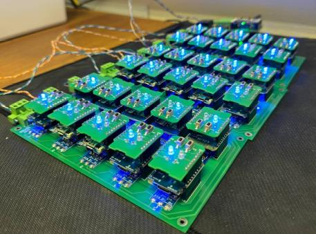

## ESP8266-Modbus

Простое ModBus-slave устройство на базе Arduino Wemos D1.  

Отвечает мастеру по четырем первым регистрам в которых содержатся 

1. адрес устройства, 

Со старта устройства 

2. часы, 
3. минуты, 
4. секунда 

### Порядок задания и проверки адреса:  

Загружаешь скетч в плату.   
* параметры порта Serial и Modbus можно изменить в скетче:  

```с
#define MB_RATE 115200        // скорость обмена по Modbus
#define MB_FC SERIAL_8E1      // параметры контроля передачи Modbus
```

Открываешь Инструменты - Монитор порта (Ctrl+Shift+M).  
Настройки порта 115200 (8N1)  
Жмешь reset на плате.   
Побежит вначале загрузочный мусор, а потом надпись вида:  

```
Address device - 1  

Wait new adress  
* command for set new address: set-xxx (001-127)  
0...  1...  2...  3...  4...  5...    

```

`Adress device` - это текущий адрес устройства. читается из eeprom в которой может быть мусор.  Если мусор значением больше 127 его скинет в 0. Так что в первый раз задавать обязательно.  
0...5 это отсчет 5сек во время которых можно запрограммировать новый адрес.  
Адрес 1 задается командой set-001 и так далее до 127. Команду, естественно, можно написать в строке заранее.  

Если команда была верная, то появится надпись   
`New adress set - 1  `

Если команда была с неверным диапазоном, то появится надпись  
`New adress set - Error  `

Если команды set- вообще не поступило, то надпись будет   
`New address not selected  `

Дальше пишется эхо-debug, который возвращает ввод любых 10 последних символов в консоль.  
Если ничего не вводить, то он не появится.  

и в конце процедуры идет надпись   
`Start programm   `
с этого момента консоль проинициализируется на конфиг обмена по modbus.  

***Вместо "монитора порта" можно пользоваться любым суровым терминальником для железа, например cutecom.***
***Ванильные putty и minicom не подойдут по причине того, что ориентированы на приглашение для ввода.***

### Проверка - чтение "датчиков" 

на примере Linux-утилиты mbpol 

`mbpoll -a 1 -b 115200 -c 4 /dev/ttyUSB0`

на примере modpoll 

`modpoll -a 1 -b 115200 -c 4 /dev/ttyUSB0`

>Скачать утилиту modpoll (Windows, Linux): https://www.modbusdriver.com/modpoll.html

### Стенд на основе Wemos D1 mini

>Описание стенда, принципиальная схема, принцип работы и утилита проверки (опроса): https://napiworld.ru/software/intructions/mbusstand/

