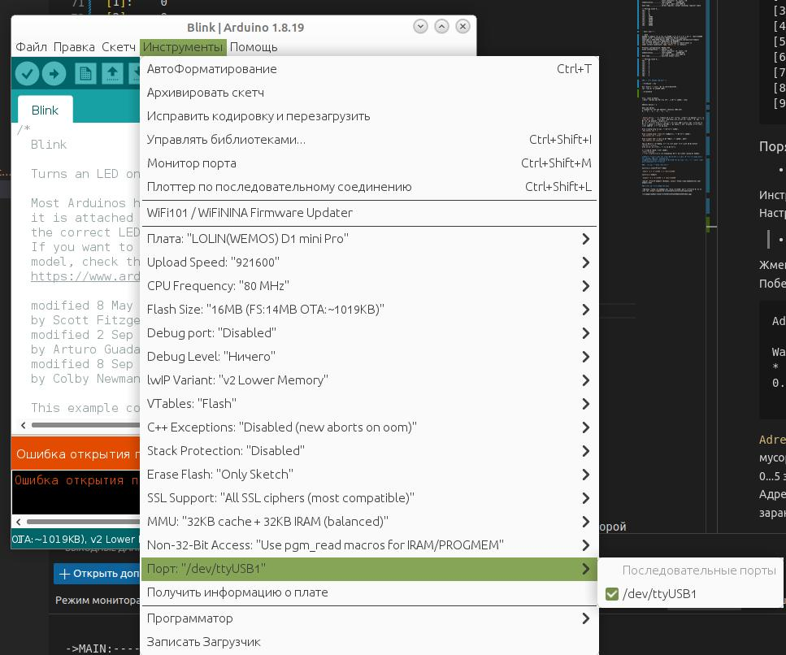
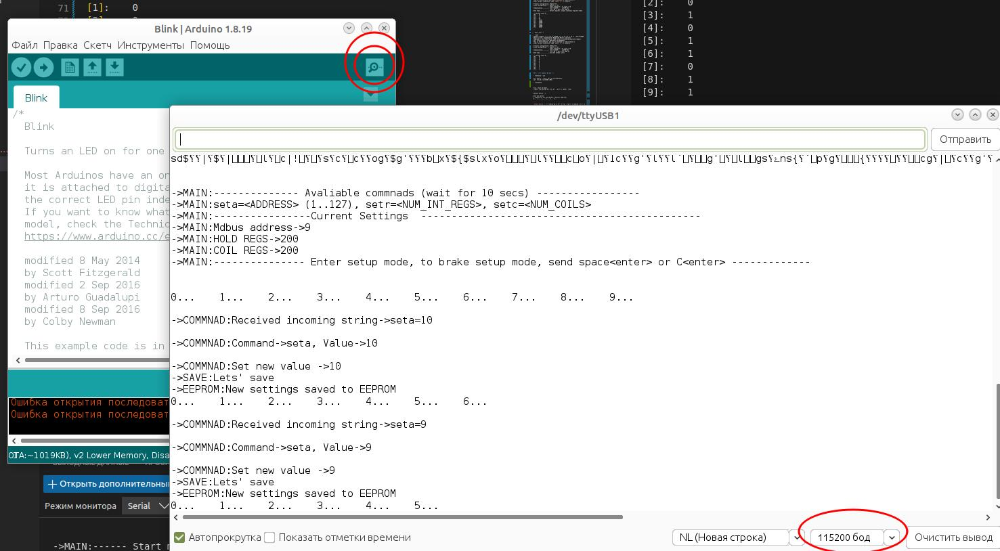
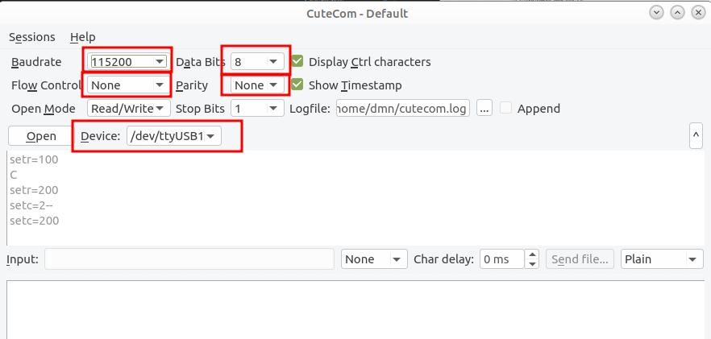

## ESP8266-Modbus

Простое ModBus-slave устройство на базе Arduino Wemos D1.  

Отвечает мастеру по регистрам holding (func code 4) и coil (func code 1).

По умолчанию количесво регистров holding=10, coils=10 и может быть изменено в
режиме setup.

В первом  регистре - адрес устройства.
Во втором регистре - часы со старта
В третьем регитсре - минуты 
В четвртом регистры - секунды  

Остальные holding-регистры заполняются автоматически случайными числами.

Coil-регистры заполнябтся случайно 0 или 1.

Результат опросов датчика при 10 регистрах

- Холд-регистры

```bash
dmn@hp:~$ mbpoll -0 -m rtu -b 115200 -a 9 -r 0 -c 10 -1  /dev/ttyUSB0
mbpoll 1.0-0 - FieldTalk(tm) Modbus(R) Master Simulator
Copyright © 2015-2019 Pascal JEAN, https://github.com/epsilonrt/mbpoll
This program comes with ABSOLUTELY NO WARRANTY.
This is free software, and you are welcome to redistribute it
under certain conditions; type 'mbpoll -w' for details.

Protocol configuration: Modbus RTU
Slave configuration...: address = [9]
                        start reference = 0, count = 10
Communication.........: /dev/ttyUSB0,     115200-8E1 
                        t/o 1.00 s, poll rate 1000 ms
Data type.............: 16-bit register, output (holding) register table

-- Polling slave 9...
[0]: 	9
[1]: 	0
[2]: 	8
[3]: 	36
[4]: 	21903
[5]: 	23509
[6]: 	10798
[7]: 	24567
[8]: 	11803
[9]: 	30506

```

- Coil-регистры

```bash
dmn@hp:~$ mbpoll -0 -m rtu -b 115200 -t 0 -a 9 -r 0 -c 10 -1  /dev/ttyUSB0
mbpoll 1.0-0 - FieldTalk(tm) Modbus(R) Master Simulator
Copyright © 2015-2019 Pascal JEAN, https://github.com/epsilonrt/mbpoll
This program comes with ABSOLUTELY NO WARRANTY.
This is free software, and you are welcome to redistribute it
under certain conditions; type 'mbpoll -w' for details.

Protocol configuration: Modbus RTU
Slave configuration...: address = [9]
                        start reference = 0, count = 10
Communication.........: /dev/ttyUSB0,     115200-8E1 
                        t/o 1.00 s, poll rate 1000 ms
Data type.............: discrete output (coil)

-- Polling slave 9...
[0]: 	0
[1]: 	0
[2]: 	0
[3]: 	1
[4]: 	0
[5]: 	1
[6]: 	1
[7]: 	0
[8]: 	1
[9]: 	1
```

### Порядок задания параметров 

- В Arduino среде

Выбрать порт, к которому присоденен Wemos



Инструменты - Монитор порта (Ctrl+Shift+M).  
Настройки порта 115200 (8N1)  




- Можно также не ставить Arduino и управлять устройство из СuteCom

В CuteCom нажать Settings



***Ванильные putty и minicom не подойдут по причине того, что ориентированы на приглашение для ввода.***


## Режим настройки устройства

1. Нажать reset на плате.   

2. Побежит вначале загрузочный мусор, а потом надпись вида:  


```
[20:01:27:084] ->MAIN:-------------- Avaliable commnads (wait for 10 secs) -----------------␍␊
[20:01:27:096] ->MAIN:seta=<ADDRESS> (1..127), setr=<NUM_INT_REGS>, setc=<NUM_COILS>␍␊
[20:01:27:097] ->MAIN:----------------Current Settings  ----------------------------------------------␍␊
[20:01:27:106] ->MAIN:Mdbus address->5␍␊
[20:01:27:134] ->MAIN:HOLD REGS->100␍␊
[20:01:27:134] ->MAIN:COIL REGS->150␍␊
[20:01:27:134] ->MAIN:--------------- Enter setup mode, to brake setup mode, send space<enter> or C<enter> -------------␍␊
[20:01:27:134] ␊
[20:01:27:134] ␍␊
[20:01:27:134] 0...⇥	1...⇥	2...⇥	3...⇥	4...⇥	5...⇥	6...⇥	7...⇥	
```

Система выводит текущие значения (по умолчанию или ранее сохраненные): Адрес - 5, Количество регистров - 100, Количество coils - 150.

**У Вас есть 10 секунд чтобы ввести команду, меняющую параметр датчика**

Команды описаны в файле `commands.h`

Текущие команды

- seta=\<ADDRESS\> установить modbus адрес
- setr=\<NUM_INT_REGS\> - количество холдинг регистров
- setc=\<NUM_COILS\> - количество coils

Если команда поступила, система ждет следующую команду.
Если команда не поступила система выходит из режима setup и начинает отвечать на modbus запросы. 

>**Параметры запомниаются в постоянной памяти, каждый раз их задавать не нужно ! **

Короткое видео настройки датчика: https://youtu.be/QDzi240QKZg

### Проверка - чтение "датчиков" 

На примере утилиты modpoll

`modpoll -m rtu -b 115200 (СКОРОСТЬ ПОРТА) -0 (АДРЕСАЦИЯ С НУЛЕВОГО ТЕГА) -a 5 (АДРЕС) -r 0 (НАЧАЛЬНЫЙ РЕГИСТР)  -c 20 (КОЛИЧЕСТВО РЕГИСТРОВ) /dev/ttyUSB0 (ПОРТ MODBUS)` 

```bash
dmn@hp:~$ modpoll -0 -m rtu -b 115200  -a 5 -r 0 -c 15 -1  /dev/ttyUSB0
modpoll 3.10 - FieldTalk(tm) Modbus(R) Master Simulator
Copyright (c) 2002-2021 proconX Pty Ltd
Visit https://www.modbusdriver.com for Modbus libraries and tools.

Protocol configuration: Modbus RTU, FC3
Slave configuration...: address = 5, start reference = 0 (PDU), count = 15
Communication.........: /dev/ttyUSB0, 115200, 8, 1, even, t/o 1.00 s, poll rate 1000 ms
Data type.............: 16-bit register, output (holding) register table

-- Polling slave...
[0]: 5
[1]: 0
[2]: 13
[3]: 3
[4]: 31612
[5]: 3410
[6]: 15279
[7]: 7875
[8]: 7638
[9]: 30138
[10]: 13989
[11]: 2900
[12]: 12570
[13]: 30266
[14]: 15884
dmn@hp:~$ 
```

```bash
dmn@hp:~$ modpoll -0 -m rtu -b 115200 -t 0  -a 5 -r 0 -c 15 -1  /dev/ttyUSB0
modpoll 3.10 - FieldTalk(tm) Modbus(R) Master Simulator
Copyright (c) 2002-2021 proconX Pty Ltd
Visit https://www.modbusdriver.com for Modbus libraries and tools.

Protocol configuration: Modbus RTU, FC1
Slave configuration...: address = 5, start reference = 0 (PDU), count = 15
Communication.........: /dev/ttyUSB0, 115200, 8, 1, even, t/o 1.00 s, poll rate 1000 ms
Data type.............: discrete output (coil)

-- Polling slave...
[0]: 1
[1]: 0
[2]: 1
[3]: 1
[4]: 1
[5]: 0
[6]: 0
[7]: 1
[8]: 1
[9]: 1
[10]: 0
[11]: 0
[12]: 1
[13]: 1
[14]: 0
dmn@hp:~$ 
```

>Скачать утилиту modpoll (Windows, Linux): https://www.modbusdriver.com/modpoll.html

### Стенд на основе Wemos D1 mini

>Описание стенда, принципиальная схема, принцип работы и утилита проверки (опроса): https://napiworld.ru/software/intructions/mbusstand/

